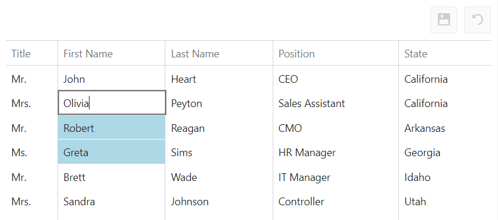

<!-- default badges list -->

[](https://supportcenter.devexpress.com/ticket/details/T361032)
[](https://docs.devexpress.com/GeneralInformation/403183)
[](#does-this-example-address-your-development-requirementsobjectives)
<!-- default badges end -->
# DataGrid for DevExtreme - How to implement selecting multiple cells with a keyboard for batch editing

This example illustrates the use of the CTRL key to edit multiple cell values simultaneously. When a user changes editor text in one location, modifications are applied to all selected cells.



## Implementation Details

1. Create an array to store selected cells.

2. Implement the [onCellClick](https://js.devexpress.com/Documentation/ApiReference/UI_Components/dxDataGrid/Configuration/#onCellClick) event handler to add a selected cell to the array when the **Ctrl** key is held. Otherwise, clear the array:

```js
onCellClick(e) {
  if (e.event.ctrlKey) {
    editCells.push(`${e.rowIndex}:${e.columnIndex}`);
  } else if (editCells.length) {
    editCells = [];
    e.component.repaint();
  }
},
```

3. Implement the [onCellPrepared](https://js.devexpress.com/Documentation/ApiReference/UI_Components/dxDataGrid/Configuration/#onCellPrepared) event handler to change the style of the selected cells:

```js
onCellPrepared(e) {
  if (e.rowType === 'data' && editCells.includes(`${e.rowIndex}:${e.columnIndex}`)) {
    e.cellElement.css('background-color', 'lightblue');
  }
},
```

4. Implement the [onEditorPreparing](https://js.devexpress.com/Documentation/ApiReference/UI_Components/dxDataGrid/Configuration/#onEditorPreparing) event handler to specify a value for all selected cells when a user edits one of them:

```js
onEditorPreparing(e) {
  const grid = e.component;
  if (e.parentType === 'dataRow') {
    const oldOnValueChanged = e.editorOptions.onValueChanged;
    e.editorOptions.onValueChanged = function onValueChanged(args) {
      oldOnValueChanged.apply(this, [args]);
      editCells.forEach((cell) => {
        const [rowIndex, columnIndex] = cell.split(':').map(Number);
        grid.cellValue(rowIndex, columnIndex, args.value);
      });
    };
  }
},
```

5. To reset the selection when changes are saved or canceled, handle the [onSaving](https://js.devexpress.com/Documentation/ApiReference/UI_Components/dxDataGrid/Configuration/#onSaving) and [onEditCanceled](https://js.devexpress.com/Documentation/ApiReference/UI_Components/dxDataGrid/Configuration/#onEditCanceled) events:

```js
onSaving() {
  editCells = [];
},
onEditCanceled() {
  editCells = [];
},
```

## Files to Review

- **jQuery**
    - [index.js](jQuery/src/index.js)
- **Angular**
    - [app.component.html](Angular/src/app/app.component.html)
    - [app.component.ts](Angular/src/app/app.component.ts)
- **Vue**
    - [HomeContent.vue](Vue/src/components/HomeContent.vue)
- **React**
    - [App.tsx](React/src/App.tsx)
- **ASP.NET Core**
    - [Index.cshtml](ASP.NET%20Core/Views/Home/Index.cshtml)

## Documentation

- [Getting Started with DataGrid](https://js.devexpress.com/Documentation/Guide/UI_Components/DataGrid/Getting_Started_with_DataGrid/)

- [DataGrid - API Reference](https://js.devexpress.com/Documentation/ApiReference/UI_Components/dxDataGrid/)

## More Examples

- [DataGrid for DevExtreme - Display tooltip for data cells](https://github.com/DevExpress-Examples/devextreme-datagrid-display-tooltip-for-data-cells)
- [DataGrid for DevExtreme - How to allow users select multiple cells](https://github.com/DevExpress-Examples/devextreme-datagrid-multiple-cell-selection)
<!-- feedback -->
## Does This Example Address Your Development Requirements/Objectives?

[](https://www.devexpress.com/support/examples/survey.xml?utm_source=github&utm_campaign=devextreme-datagrid-batch-editing-select-multiple-cells&~~~was_helpful=yes) [](https://www.devexpress.com/support/examples/survey.xml?utm_source=github&utm_campaign=devextreme-datagrid-batch-editing-select-multiple-cells&~~~was_helpful=no)

(you will be redirected to DevExpress.com to submit your response)
<!-- feedback end -->
